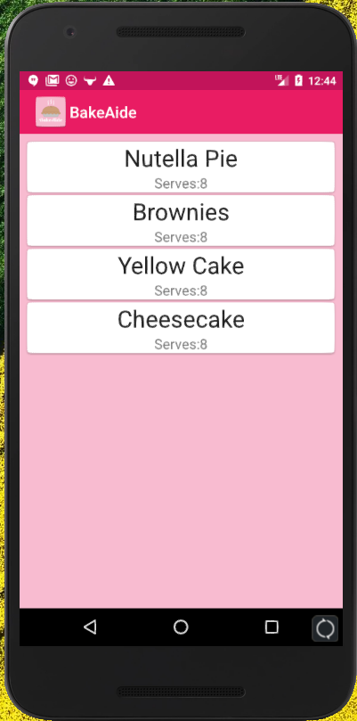
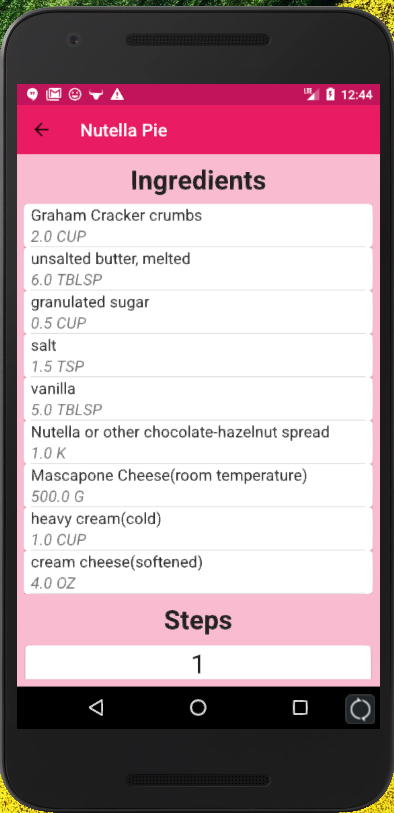
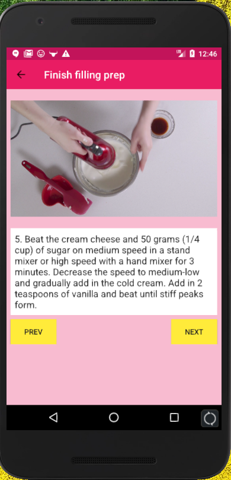
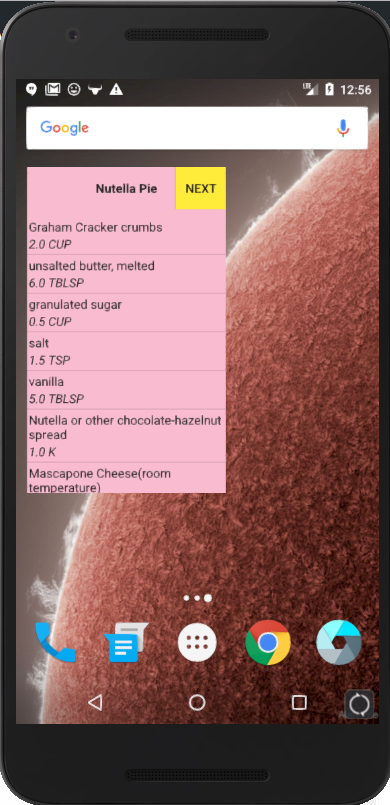
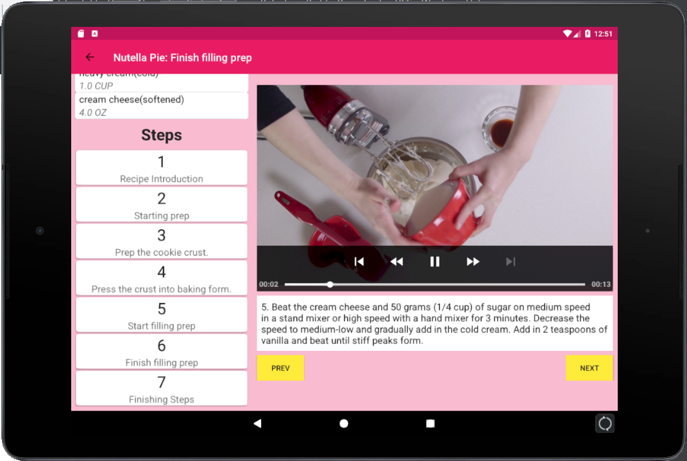

# BakeAide
BakeAide is an android application written in java that details recipe instructions for baked goods. 
 
The application follows an MVVM architecture  
A single activity pattern is used for flexible UI.  
Video is played using ExoPlayer   
Data is fetched from Udacity's sample API in JSON format using Retrofit.  
Room is used for persistent data storage.  
RecyclerView is used to show lists.  
The application includes an interactive widget that displays the ingredients of the recipes.  
 
The main screen of the application shows available recipes:  
  
 
Clicking on an item shows its ingredients and the overview of the steps:  
  
  
 
Clicking on a recipe step shows detailed information about the step including a video:   
  
 
The widget of the application allows viewing of the ingredients:  
  
 
A single activity with multiple fragments allow for flexible UI for tablets:  
  
 
Any suggestions will be greatly appreciated!

